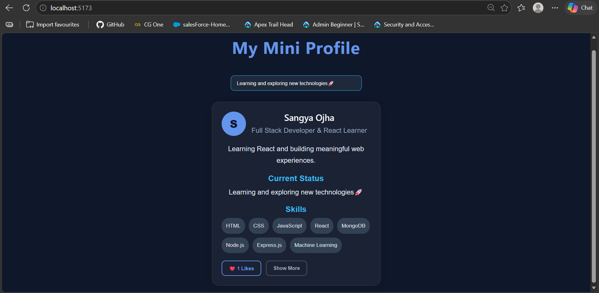
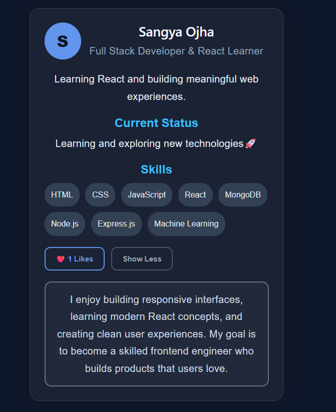

<h1 align="center" style="color:#6495ED;">
  🚀 My Mini Profile
</h1>
<p align="center">
  Exploring React Fundamentals Through a Personal Profile Card
</p>

## UI Preview

### Home View


### Expanded View


---

## Overview

A simple React profile application demonstrating fundamental React concepts through an interactive personal profile card.

---

## Features

- Display profile information using **props**
- Like button with dynamic count using **useState**
- Skills rendered from an array using **map()**
- Toggle additional information with **conditional rendering**
- Live status updates using a **controlled input**
- Browser tab title updates with **useEffect**

---

## React Concepts Used

### Props
Used to pass profile data (`name`, `bio`, `status`) from `App` to `ProfileCard`.

### useState
Manages:
- Likes count
- Show/Hide additional bio
- Status input value

### map()
Renders the skills list dynamically.

### Conditional Rendering
Shows or hides the extended bio section.

### useEffect
Updates the browser tab title with the current like count.

---

## Project Structure

```text
src/
├── App.jsx
├── ProfileCard.jsx
├── App.css
└── assets
├── main.jsx
├── ProfileCard.jsx

```
---

## Learning Outcome

This project demonstrates:

- Component creation and reuse
- Props for data passing
- State management with `useState`
- Controlled inputs
- List rendering using `map()`
- Conditional rendering
- Side effects using `useEffect`

---
